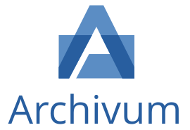

<p align="center">
  
</p>

<p align="center">
  Open-source document management for <strong>physical</strong> archives.
</p>

<p align="center">
  <a href="#quick-start">Quick start</a> ·
  <a href="docs/">Documentation</a> ·
  <a href="CONTRIBUTING.md">Contributing</a> ·
  <a href="#license">License</a>
</p>

---

Archivum is a searchable database for documents you keep on paper — in covers,
folders, binders, cabinets or drawers — and for their scans.

The core principle is:

> Logical organization and physical organization are separate concepts.

A document is categorised, tagged and searched independently of where its paper
copy sits. You can reorganise the archive without breaking how documents are
found, and find a document without knowing which drawer it is in.

## What it does

- **Registers physical documents** with a type, a date and metadata that varies
  by type.
- **Stores scans, PDFs and photographs** against them.
- **Reads them.** Uploaded files have their text extracted in the background —
  the embedded text layer where a PDF has one, OCR where it does not — so a
  document is findable by what is written on the page, not only by its title.
- **Knows where the paper is.** A configurable hierarchy models the filing
  system you already use, and suggests where a new document should go.
- **Keeps the history.** Every move is recorded, so "where was this last year?"
  has an answer.
- **Separates workspaces.** Several independent archives, several users each,
  with roles and per-workspace limits.
- **Runs on your own hardware**, with nothing phoning home.

Nothing in the schema knows what a *cover* or a *drawer* is. `Cover → Letter →
Position` and `Cabinet → Drawer → Folder → Position` are the same tables with
different configuration.

## Quick start

### Self-hosting

```bash
curl -O https://raw.githubusercontent.com/jneto14/archivum/main/compose.prod.yaml
```

Then write a `.env` and bring the stack up. The full recipe — including the
variables whose absence is silently wrong — is in
**[docs/deployment.md](docs/deployment.md)**.

Images are published on every release to Docker Hub and GHCR, for `amd64` and
`arm64`:

```text
jneto14/archivum:latest
ghcr.io/jneto14/archivum:latest
```

### Development

Requires Docker; nothing else has to be on your machine.

```bash
git clone https://github.com/jneto14/archivum.git
cd archivum

cp .env.example .env
./vendor/bin/sail up -d
./vendor/bin/sail composer setup
./vendor/bin/sail composer dev
```

See **[docs/development.md](docs/development.md)** for the rest, including the
one trap worth knowing about before it costs you an afternoon.

## Documentation

| | |
| --- | --- |
| [architecture.md](docs/architecture.md) | The stack, the request path, and where each kind of logic lives |
| [database.md](docs/database.md) | The tables, how they relate, and the conventions |
| [workspace.md](docs/workspace.md) | Workspaces, membership, roles, isolation, usage and limits |
| [documents.md](docs/documents.md) | Documents, types, dynamic metadata, tags and attachments |
| [organization.md](docs/organization.md) | The configurable physical filing system |
| [search.md](docs/search.md) | Scout, the full-text index, and the two search modes |
| [storage.md](docs/storage.md) | Where files live, and what the database keeps about them |
| [ocr.md](docs/ocr.md) | Text extraction: the pipeline, its binaries and its failure modes |
| [api.md](docs/api.md) | The HTTP API surface, such as it currently is |
| [development.md](docs/development.md) | Running it locally, the checks, and the conventions |
| [deployment.md](docs/deployment.md) | Running it in production |
| [roadmap.md](docs/roadmap.md) | Scope, principles, and possible future work |

## Built with

Laravel 13 and PHP 8.5, React and TypeScript over Inertia, Tailwind CSS with
shadcn/ui, MySQL, Laravel Scout for search, and Redis for cache and sessions.
Text extraction uses `pdftotext`, Ghostscript and Tesseract. The production
image is FrankenPHP — one image serving the web, the queue worker and the
scheduler.

## Status

**Current release: [0.3.1](CHANGELOG.md).**

The core domain — workspaces, documents, physical organization, search and text
extraction — is built, tested and documented. The major version is 0 because
the edges are still moving: while it stays there, the database schema, the
environment variables and the image's behaviour may change in a minor release.
Read the [changelog](CHANGELOG.md) before upgrading.

## Contributing

Issues and pull requests are welcome. See [CONTRIBUTING.md](CONTRIBUTING.md)
for the workflow, and [CODE_OF_CONDUCT.md](CODE_OF_CONDUCT.md) for the ground
rules.

Security vulnerabilities should **not** go in a public issue —
[SECURITY.md](SECURITY.md) has the private reporting process.

## License

Archivum is licensed under the [Elastic License 2.0](LICENSE) (ELv2).

You are free to use, modify and self-host Archivum, including in production.
The only restriction is that you may not offer Archivum to third parties as a
hosted or managed service.
